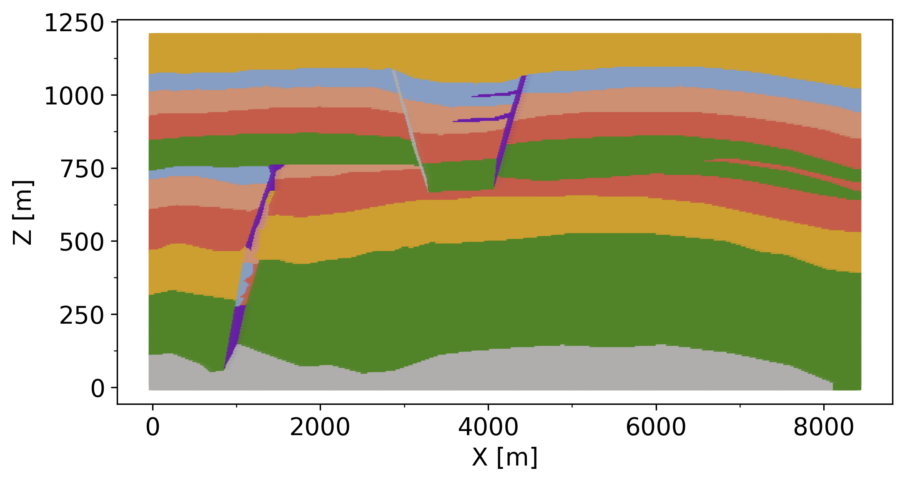
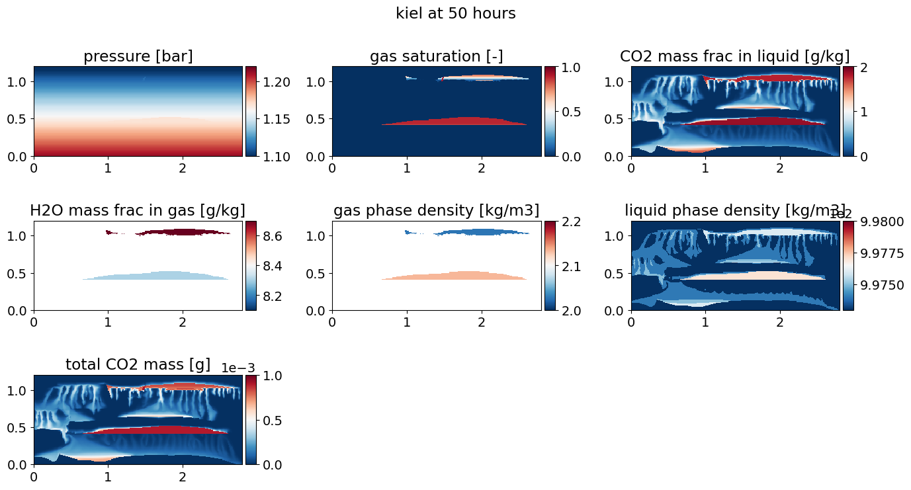
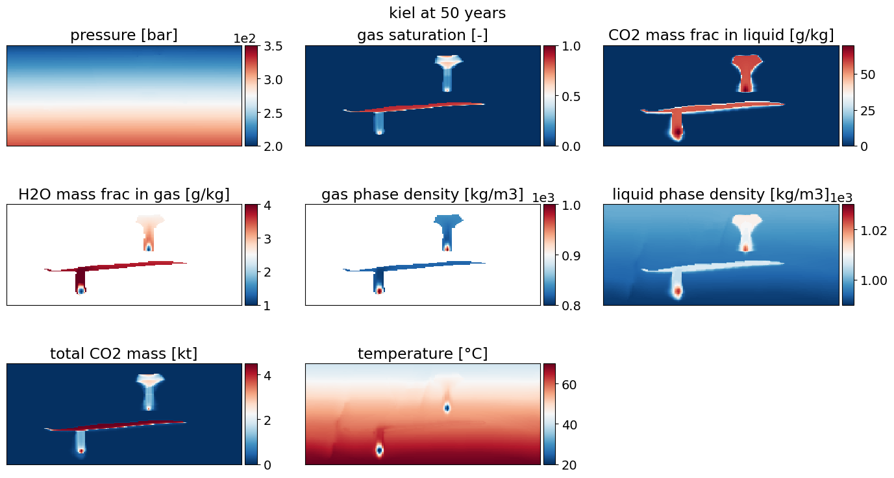

# 11thSPE-CSP-Kiel
This repository contains scripts and inputs for generating models for the [Society of Petroleum Engineers Comparative Solution Project (11th SPE CSP)](https://github.com/Simulation-Benchmarks/11thSPE-CSP) from the Kiel group. The study aims to evaluate and compare reservoir simulation codes based on three problems. The problem description and key assumptions are available in the [11thSPE-CSP repository](https://github.com/Simulation-Benchmarks/11thSPE-CSP) and in the paper [Nordbotten et al. (2024)](https://doi.org/10.2118/218015-PA).
The Kiel group applied the OPM Flow 2024.04 simulator, which has been compiled and run on the Linux CAUCLUSTER of Kiel University. The operating system of the caucluster is Rocky Linux 8.6 (Green Obsidian): Linux caucluster1 4.18.0-372.9.1.el8.x86_64.

## Usage

To build the grid/mesh for models using the reporting grid:

```bash
python generate_model_geometry.py -c spe11a -f datasets -ni 280 -nj 1 -nk 120 -dx 0.01 -dy 0.01 -dz 0.01 -z0 0
python generate_model_geometry.py -c spe11b -f datasets -ni 842 -nj 1 -nk 120 -dx 10 -dy 1 -dz 10 -z0 0
python generate_model_geometry.py -c spe11c_kiel -f datasets -ni 170 -nj 100 -nk 120 -dx 50 -dy 50 -dz 10 -z0 500
```

To generate spe11c grid using parabolic shape with 10 m depth offset and 150 m amplitute apply the following:
```bash
python generate_model_geometry.py -c spe11c -f datasets -ni 170 -nj 100 -nk 120 -dx 50 -dy 50 -dz 10 -z0 150
```

To generate model parameters (e.g., petrophysics), we used the structural grid provided by the SPE Community Resources. This script simply replaces the facies with input parameters:
```bash
python generate_model_params.py -c spe11a -f ..\datasets\SPE11A_280x1x120.vtu
```


To generate fluid PVTx and rela data:
```bash
python generate_fluid_models.py -c spe11a -f datasets
```
For the internal PVT sensitivity study, the CoolProp thermodynamic library v6.6.0 is used. According to the sensitivity analysis for all three problems, the fluid PVT properties are used according to the pre-built PVT models within the OPM Flow code.

To write report files(spars, performance, time series):
```bash
python write_performance_data.py -c spe11a -f rst_SPE11A_280x1x120_CAUCLUSTER
```

To generate spatial maps for all time steps using the official 11thSPE-CSP functions, use the following:

```bat
@echo off
setlocal enabledelayedexpansion

for /f "tokens=3,4 delims=_" %%A in ('dir /b *.csv ^| sort /+2') do (
    set "filename=%%B"
    set "filename=!filename:y.csv=!"
    echo !filename!
    python ./11thSPE-CSP/.../spe11b_visualize_spatial_maps.py -f spe11b -t !filename! -g kiel
    )
```

## Key findings and deviations from the description

* We used the CoolProp thermodynamic library v6.6 to calculate fluid PVT properties for all three problems instead of the NIST database. 
* After conducting a sensitivity analysis, we switched to using the pre-built equation of state model for the CO2-H2O system within the OPM Flow code instead of the CoolProp library for reported simulations. 
* __SPE11A__
  * The problem is numerically unstable, and timestep adjustment is needed, particularly for injection with well #2. CO2 dissolution in the highly permeable fault damage zone requires a small time step size of less than or equal to 1 second.
  * The pre-built OPM Flow gas-water black oil model performs better than the gas-oil model in comparison.
  * The presence of initial capillary pressure for the absence phase ("virtual" gas) has a significant impact on dissolution rates. Therefore, data increments in the relative permeability/capillary pressure functions (RELA) should be relatively small.
  * High node numbers at the cluster will not always decrease total runtime. Instead, domain decomposition may lead to issues with numerical stability. Therefore, only 14 logical cores are used for this problem.   

* __SPE11B__
  * Unphysical temperature oscillation occurs at the cells adjacent to the well #1 perforation.
  * For problems #spe11bc, 32 logical cores are used.
  * The derivation of CO2 and H2O mole fractions from black oil models is based on [Hassanzadeh et al. (2008)](https://www.sciencedirect.com/science/article/pii/S1750583607000102).

* __SPE11C__
  * The mesh is based on a Gaussian function to mimic the anticline shape. This approach allows us to keep the crest point and dip angle according to the benchmark description. The resulting mesh is fully symmetric.
  * Injection well depth is not explicitly given, and due to gridding reference depth for initialisation, specifying pressure at the centerline of Well #1 of 300 bar may lead to significant deviation. 
  

## License
This repository is licensed under the [GPL-3.0 license](LICENSE). You are free to use, modify and distribute the software under certain conditions. Any distribution of the software must also include a copy of the license and copyright notices.

## Acknowledgement
This research was supported in part through high-performance computing resources available at the Kiel University Computing Centre.

## Reference
- Nordbotten, J. M., Ferno, M. A., Flemisch, B., Kovscek, A. R., & Lie, K.-A. (2024). The 11th Society of Petroleum Engineers Comparative Solution Project: Problem Definition. *SPE J*.
- Bell, I. H., Wronski, J., Quoilin, S., & Lemort, V. (2014). Pure and pseudo-pure fluid thermophysical property evaluation and the open-source thermophysical property library CoolProp. *Industrial & Engineering Chemistry Research*.
- Hassanzadeh, H., Pooladi-Darvish, M., Elsharkawy, A. M., Keith, D. W., & Leonenko, Y. (2008). Predicting PVT data for CO2–brine mixtures for black-oil simulation of CO2 geological storage. *International Journal of Greenhouse Gas Control*.